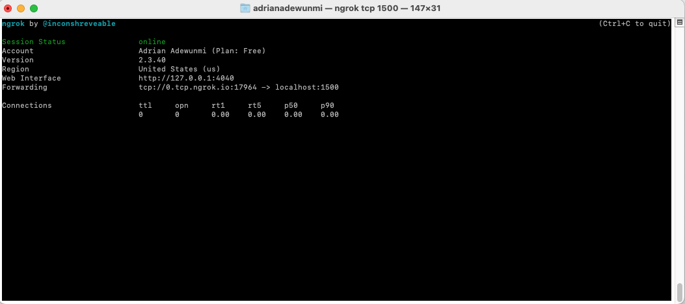

# Project Title: TCP Chat Application

## What is the project?

This is a GUI based Chat Application built using Java 9, Java Swing and Ngrok 

## Tech Stack:

- Java 11
- Swing GUI
- Port Forwarding System - Ngrok

## Ngrok Installation (Global, OSX):

1. Installing ngrok on OSX (Read Github Gist below):

https://gist.github.com/wosephjeber/aa174fb851dfe87e644e

2. Access Ngrok TCP tunnel using Terminal: 

Run > $ ngrok tcp 1500

> TERMINAL ERROR MESSAGE!

TCP tunnels are only available after you sign up.
Sign up at: https://dashboard.ngrok.com/signup

If you have already signed up, make sure your authtoken is installed.
Your authtoken is available on your dashboard: https://dashboard.ngrok.com/get-started/your-authtoken 

Run > $ ngrok authtoken [TOKEN]

Re-Run > $ ngrok tcp 1500

3. Use Ngrok as a service in Intellij IDE (YouTube Video):

https://www.youtube.com/watch?v=eMt29lTPh8I

## What is the MVP?

The minimal viable product is a client-server application that runs the client(s) GUI and server GUI on screen and they can send messages between each other.

## What are the sprinkles (Nice to haves)?

The sprinkles for this project is styling the GUI's as JavaFX GUI's.

## When will the project be complete?

The project will be complete once all the MVP features have been implemented and the application has been styled.

## Adapted from:

UDEMY: Java Development Mega Course: Build Projects Practically

(Java Programming Course: Learn Development of JAVA Projects Using JSP, JDBC, Servlets, Swing, Spring Boot, Maven, Hibernate)

Project Name: Project 38: TCP Chat Application

Created by: Engineering.Org.In

Last updated: 03/2022

URL: https://www.udemy.com/course/build-real-world-java-projects-using-spring-jsp-jdbc/
