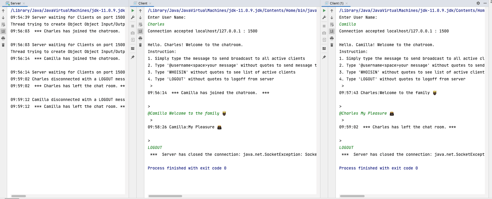

# Project Title: 

A Console-based TCP/IP Chat Messenger Application


## 1. Project Description:

This is a console-based Chat Application built using Java 9. It includes functionality 
for exposing a local development server to the internet using "Ngrok". 


## 2. Tech Stack:

- Java 11
- Port Forwarding System - Ngrok 


## 3. Intall Project:

i. Clone the git repo

```
https://github.com/AAdewunmi/TCP_Chat_Application.git
```

ii. Open project folder

iii. Explore


## 4. Register and Install Ngrok (Global, OSX):


i. Installing ngrok on OSX (Read Ngrok documentation and Github Gist below):

https://gist.github.com/wosephjeber/aa174fb851dfe87e644e

(https://ngrok.com/docs/getting-started)

ii. Access Ngrok TCP tunnel using Terminal: 

Run > $ ngrok tcp 1500

> TERMINAL ERROR MESSAGE!

TCP tunnels are only available after you sign up.
Sign up at: https://dashboard.ngrok.com/signup

If you have already signed up, make sure your authtoken is installed.
Your authtoken is available on your dashboard: https://dashboard.ngrok.com/get-started/your-authtoken 

Run > $ ngrok authtoken [TOKEN]

Re-Run > $ ngrok tcp 1500


iii. Use Ngrok as a service in Intellij IDE (YouTube Video):

https://www.youtube.com/watch?v=eMt29lTPh8I


## 5. How To Use:


## 6. Demo (Chat Screenshot):



## 7. Contribution:

Pull requests are welcome. For major changes, please open an issue first to discuss what you would like to change.

## 8. Adapted from:

UDEMY: Java Development Mega Course: Build Projects Practically

(Java Programming Course: Learn Development of JAVA Projects Using JSP, JDBC, Servlets, Swing, Spring Boot, Maven, Hibernate)

Project Name: Project 38: TCP Chat Application

Created by: Engineering.Org.In

Last updated: 03/2022

URL: https://www.udemy.com/course/build-real-world-java-projects-using-spring-jsp-jdbc/
