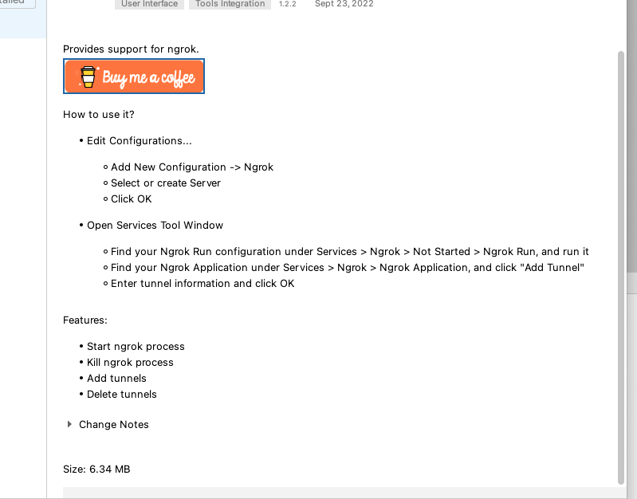

# Project Title: TCP Chat Application

## What is the project?

This is a GUI based Chat Application built using Java 9, Java Swing and Ngrok 

## Tech Stack

- Java 11
- Swing GUI
- Port Forwarding System - Ngrok
## Ngrok Installation:
### This install process is for a local machine, using it's own port. Ngrok will create several instances of a Client but will not use its forwarding service.

> Get Ngrok API Key:

1. Log into -> 

https://dashboard.ngrok.com/login

(I used my Github account to login.) 

2. Suggested reading -> 

https://ngrok.com/docs/api

> Add Ngrok Configuration to IDE (Intellij Community Verson)

(I'm using Intellij for this project.)

1. First of all, install Ngrok plugin in Intellij.

2. Activate plugin using API key (YouTube Video):

https://www.youtube.com/watch?v=eMt29lTPh8I

> How to use Ngrok in Intellij:

(Follow Instructions!)

### For this project's next iteration, I will install Ngrok globally to enable our application to use it's forwarding service.

## What is the MVP?

The minimal viable product is a client-server application that runs the client(s) GUI and server GUI on screen and they can send messages between each other.

## What are the sprinkles (Nice to haves)?

The sprinkles for this project is styling the GUI's as JavaFX GUI's.

## When will the project be complete?

The project will be complete once all the MVP features have been implemented and the application has been styled.

## Adapted from:

UDEMY: Java Development Mega Course: Build Projects Practically

(Java Programming Course: Learn Development of JAVA Projects Using JSP, JDBC, Servlets, Swing, Spring Boot, Maven, Hibernate)

Project Name: Project 38: TCP Chat Application

Created by: Engineering.Org.In

Last updated: 03/2022

URL: https://www.udemy.com/course/build-real-world-java-projects-using-spring-jsp-jdbc/
